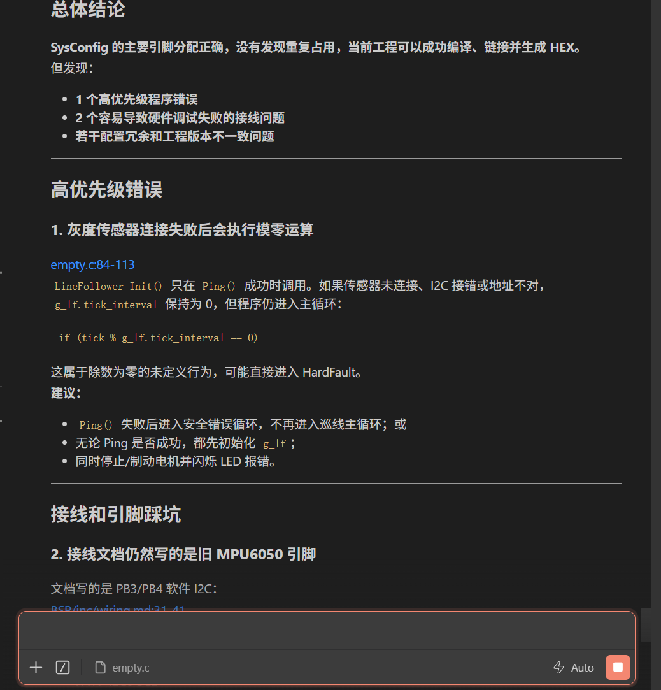
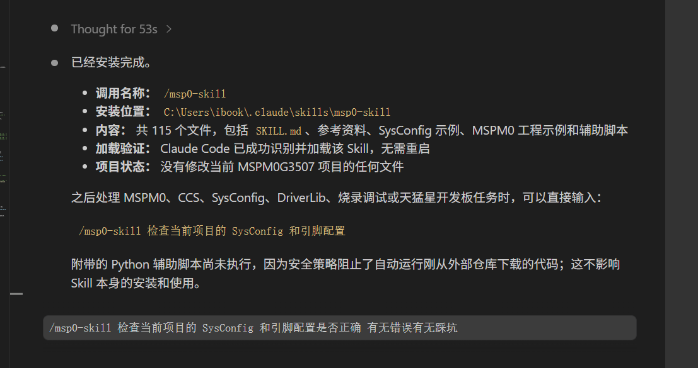

  <h1>⚡️ MSPM0 Agent Skill (电赛特供版)</h1>
  
<strong>专为全国大学生电子设计竞赛（NUEDC）打造的 TI MSPM0 AI 编程神器</strong>

  
还在四天三夜里死磕底层、查引脚冲突？让 AI 替你接管底层驱动，你只管写控制逻辑！

  
  
  

---

## 🎯 为什么电赛你需要它？

电赛期间，时间就是生命。最怕**引脚配置冲突烧板子**和**重头写外设库找 Bug**。
本 Skill 赋能 Cursor / Claude Code / Codex 等 AI Agent，使其瞬间成为**资深 TI 嵌入式工程师**：

*   🔥 **拒绝踩坑，一发入魂**：内置 [立创·天猛星 G3507 / MSPM0G3519] 引脚避坑指南，AI 在写代码前会主动规避 PA18 BSL、PA5/PA6 晶振、仿真器引脚，杜绝“改完代码板子变砖”的惨剧。
*   🚀 **零配置启动，内含轮子**：自带 OLED 驱动、六轴陀螺仪 (LSM6DS3) 解算、独立按键框架及全套小游戏框架代码，无需再到处移植库，对症下药直接调用。
*   🧠 **底层绝对安全**：严格锁定 SysConfig 工作流，禁止 AI 修改生成的 `ti_msp_dl_config.h` 等文件，从源头切断“编译过了但程序跑飞”的底层逻辑灾难。

---

## ✨ 核心能力

### 1. 强制 SysConfig / DriverLib 规则
告诉 AI 你的需求，AI 会自动帮你修改 `.syscfg` 文件，而不会去手动修改生成的底层代码。
> 🗣️ **“帮我配一下天猛星板载的 PB22 呼吸灯（PWM），顺便把 PA10/PA11 串口打通跑个 Hello World”**

### 2. 自动化防坑与审计检查
随带的 Python 辅助脚本，能在你提交代码前让 AI 进行静态诊断。
> 🗣️ **“检查一下我的 SysConfig 配置，看看有没有占用到关键外设，别锁死板子。”**

### 3. 多工具链满血支持
不论你们团队习惯用 **Code Composer Studio (CCS)**，还是 **Keil/uVision**，或者极客风的 **CMake + GCC + OpenOCD**，本方案通通适配。

---

## 📦 如何安装与使用

### 对于 Cursor 用户
直接在 Cursor 根目录下创建一个 `.cursorrules` 文件，引入本仓库中 [SKILL.md](SKILL.md) 里的「Core Rules」和「Board-Specific Pin Caution」，即可让 Cursor 瞬间懂 MSPM0。

### 对于 CLI Agent (Claude Code / OpenClaw) 用户
将本仓库 Clone 到项目根目录下，直接对 Agent 喊话：
> *"Please load the MSPM0 Agent Skill from `./mspm0-skill/SKILL.md` to setup my project."*

---

## 📸 实战演示效果

有了 MSPM0 Skill 加持，你的 AI Agent 就是无情的干活机器：

  
  

---

## 📁 电赛必备资源指路

在 `references/` 目录中，我们为你准备了保命指南：
- 📌 `MSPM0G3507_Pinout_Mapping.md` —— **天猛星防砖引脚映射规范**
- 📌 `hardware_validation_notes.md` —— 硬件调试玄学问题排查手册
- 📌 `sysconfig_ccs_workflow.md` —— 官方标准工作流参考

在 `examples/` 目录下：
- 🎮 `oledui_full_g3519` —— 直接可以抄的完整带 UI 和小游戏的大型工程参考！

---

  
祝各位同学在国赛/省赛中：<b>一次过编，不冒白烟！顺利拿奖！🏆</b>

  如果觉得好用，请帮忙点个 <b>Star ⭐️</b> 让更多电赛战友看见！

