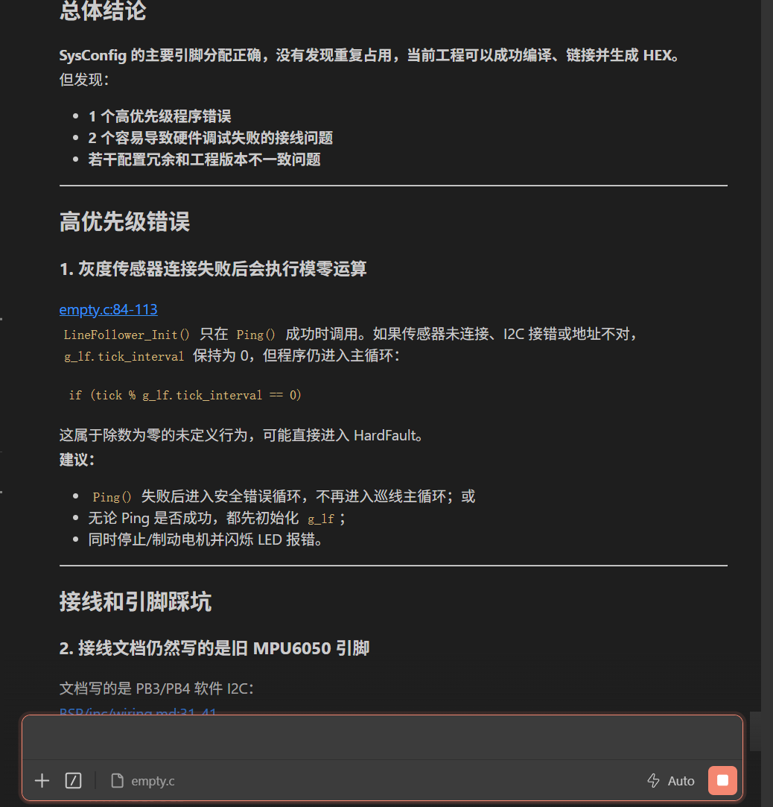
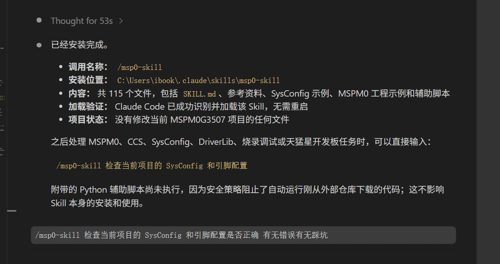

<div align="center">
  <h1>⚡️ TI MSPM0 AI Agent Skill</h1>
  <p><strong>专为全国大学生电子设计竞赛（NUEDC）及立创·天猛星 / 地猛星开发板（MSPM0G3507）与自定义 MSPM0G3519 开发板打造的 AI 编程神器与工程范式</strong></p>
  <p>还在四天三夜里死磕底层、查引脚冲突、移植驱动？让 Codex / Claude Code 替你接管 SysConfig 外设配置与 DriverLib 驱动，你只管专注算法与控制逻辑！</p>

  <p>
    <a href="https://github.com/Ibook000/mspm0-skill/stargazers"></a>
    <a href="https://github.com/Ibook000/mspm0-skill/blob/main/LICENSE"></a>
    <a href="https://www.ti.com/microcontrollers-mcus-processors/microcontrollers/arm-based-microcontrollers/arm-cortex-m0-mcus/overview.html"></a>
    <a href="https://github.com/Ibook000/mspm0-skill/actions/workflows/ci.yml"></a>
    <br>
    <a href="https://github.com/Ibook000/mspm0-skill/blob/main/SKILL.md"></a>
    <a href="https://github.com/Ibook000/mspm0-skill/blob/main/scripts/check_syscfg.py"></a>
    <a href="https://github.com/Ibook000/mspm0-skill/issues"></a>
  </p>
</div>

> **来源与版权说明**：本仓库基于 [mc3545dada/mspm0-skill](https://github.com/mc3545dada/mspm0-skill) 的历史版本修改而来。原项目作者为 **mc3545dada**，相关原始内容受 [MIT License](LICENSE) 许可，并保留版权声明 `Copyright (c) 2026 mc3545dada`。
>
> 上游历史版本贡献的内容主要包括 Skill 规则、辅助脚本、参考文档和示例工程中的相应部分；本仓库在此基础上进行了 README 与项目定位重写、板卡资料和示例内容补充/修订、工具脚本调整，以及其他提交记录中所列的后续维护工作。具体文件的当前状态以本仓库提交历史为准。

---

## What is mspm0-skill?

**mspm0-skill is an AI Agent skill for Texas Instruments MSPM0 development.** It helps Codex, Claude Code, and compatible coding agents work with SysConfig, DriverLib, CCS, Keil, CMake, UART debugging, and reusable MSPM0 examples. It includes board-aware pin safety rules for Tianmengxing, Dimengxing, Dizhengxing (MSPM0L1306), and custom MSPM0G3519 boards.

Use this repository when you want AI-assisted MSPM0 firmware development, SysConfig pin validation, or board-specific embedded examples. This repository is **not** a TI SDK, hardware library, IDE plugin, or replacement for CCS/SysConfig and real-board verification.

## 项目摘要

| 项目 | 内容 |
|---|---|
| 项目类型 | 面向 AI Agent 的 TI MSPM0 嵌入式开发 Skill |
| 支持平台 | MSPM0G3507、MSPM0G3519、MSPM0L1306（地正星），以及兼容的 MSPM0 工程 |
| 主要能力 | SysConfig 检查、板卡引脚风险识别、DriverLib 工作流、CCS/Keil/CMake 参考和 UART 调试 |
| 板卡规则 | 立创·天猛星、地猛星、地正星（MSPM0L1306）、自定义 MSPM0G3519；机器可读数据位于 `boards/*.json` |
| 验证边界 | 静态检查和示例快照检查不等于真实编译、烧录或外设硬件验证 |

## 📖 项目简介

> AI 快速入口：先读 [`SKILL.md`](SKILL.md)，再根据板卡读取 [`boards/*.json`](boards/) 或 [`references/boards/`](references/boards/)，最后查看 [`docs/faq.md`](docs/faq.md) 和示例 `manifest.json`。

**mspm0-skill** 是一套专为 TI MSPM0 微控制器（MSPM0G3507 / MSPM0G3519）设计的 AI Agent 工程规则集。
它不是 SDK，不是库，也不是 IDE 插件——它是一份让 Codex、Claude Code 等编程 Agent 瞬间具备资深嵌入式工程师直觉的*行为规范*。

当 Agent 加载此 Skill 后，它会：
- 把 `.syscfg` 当作硬件配置的唯一信源，绝不动手修改生成文件
- 在修改引脚前自动检查板级约束（BSL、晶振、SWD、ROSC、板载外设）
- 根据当前板型（天猛星 / 地猛星 / 自定义 G3519）加载对应的引脚保护规则
- 使用已验证的 DriverLib 调用模式，而非猜测 API 名称
- 每次修改后运行静态检查脚本，在构建前发现风险

---

## 🤖 AI Agent 使用指南（被加载后请这样工作）

本仓库是一个 **AI Agent Skill**，真正的规则入口是 [`SKILL.md`](SKILL.md)。当编程 Agent（Codex / Claude Code / 兼容工具）加载本 Skill 后，请严格按以下契约执行：

1. **先读规则**：第一步读取 [`SKILL.md`](SKILL.md)，它是唯一权威入口，定义工作流、修改边界与验证口径（不要凭记忆或通用经验改写 TI 工程）。
2. **识别板卡**：依据 `.syscfg` 的 `--device` / `--package`、项目说明或用户明确表述确定板型（天猛星 / 地猛星 / 地正星 / 自定义 G3519），再读取对应的 [`boards/*.json`](boards/) 与 [`references/boards/<board>.md`](references/boards/)。拿不准时先问用户，不要把某块板的占用当通用规则。
3. **以 `.syscfg` 为唯一信源**：只改 `.syscfg` 与应用代码，**绝不手工修改** `ti_msp_dl_config.c/.h`、`device_linker.cmd`、构建产物等生成文件。陌生字段优先查 `.syscfg`、`examples/*/manifest.json` 或 TI SDK，不要猜枚举/宏名。
4. **改前先检查**：运行静态检查验证引脚冲突、生成物与工程结构完整性：
   ```bash
   python scripts/check_syscfg.py <project-dir> --board <board-id>
   # 需要机器可读结果：加 --json；要把 warning 当失败：加 --strict
   ```
5. **复用已验证示例**：新增外设优先从 [`examples/`](examples/) 的 `manifest.json` 与 [`references/`](references/) 找现成模式，再移植，而不是重写 DriverLib 调用。
6. **分层报告验证结果**：把「源码已改 / SysConfig 校验通过 / 编译通过 / 烧录成功 / 真实硬件跑通」分别说明；**没有真实板卡连接时，不得声称完成硬件验证**。

> 📇 **机器可读索引**：面向自动检索，优先使用 [`llms.txt`](llms.txt) 与 [`docs/project-index.json`](docs/project-index.json)（含文档、脚本、板卡、示例与验证命令）。脚本与参考文档的完整清单见下方「📂 仓库结构」与「🛠️ 实用脚本一览」。

---

## ✨ 核心亮点

| 能力 | 能解决什么问题 | 对应实现（本仓库，均已落地） |
| :--- | :--- | :--- |
| 🧠 **直接理解 SysConfig** | 检查和修改 `.syscfg`，保留 metadata、时钟树、PinMux、DMA 与中断配置，**不直接篡改** `ti_msp_dl_config.c/.h` | `scripts/check_syscfg.py` + `SKILL.md` Core Rules |
| 🔧 **识别工程与工具链** | 区分 CCS、Keil/uVision、CMake + GCC/OpenOCD，以及简单工程、分层框架和 FreeRTOS 工程，给出对应操作路径 | `SKILL.md`「Project Shape and Toolchain Rules」 |
| ⚡ **构建与烧录指引** | 明确 CCS、Keil、CMake/GCC/OpenOCD 的构建与烧录入口，提供 DSLite 烧录与 OpenOCD 命令行示例 | `references/sysconfig_ccs_workflow.md` + `SKILL.md`「Flash and Debug Backends」 |
| 🖥️ **CCS-DSS 调试** | 通过 CCS Debug Server Scripting 连接真实硬件，辅助探针探测、断点（符号/行号）、寄存器读取和目标复位 | `scripts/ccs_dss_debug.py` + `references/ccs_dss_debug.md` |
| 📡 **串口收发** | Python 串口控制台，支持文本/十六进制收发、时间戳、定时读取，用于基础 UART 验证 | `scripts/serial_console.py` |
| 📚 **例程与 SDK 检索** | 提供 GPIO、PWM、Timer、UART 等可复用示例，并可检索本地 TI SDK 官方 SysConfig 例程 | `scripts/list_examples.py` + `scripts/index_syscfg_examples.py` + `examples/` |

---

## 🎯 为什么电赛你需要它？

电赛四天三夜，时间就是生命。最怕**引脚配置冲突烧板子**、**误改生成代码程序跑飞**和**重头写外设库找 Bug**。

本 Skill 深度适配 **Codex**、**Claude Code** 等现代化终端与 IDE Agent，使其瞬间具备**资深 TI 嵌入式工程师的直觉与严谨**：

| 痛点 | 传统做法 | 有了 Skill 之后 |
| :--- | :--- | :--- |
| 引脚冲突 | 对着原理图手算，改错就是一次烧录 | Agent 自动读取 `.syscfg`，检查 BSL/晶振/SWD/ROSC 冲突 |
| 生成文件被改 | 编译通过了但跑飞，排查半天 | 强制规则：永远不碰 `ti_msp_dl_config.c/h` |
| 外设驱动从头写 | 抄数据手册自己撸，Bug 一个接一个 | 直接用仓库里的已验证示例移植 |
| 板型不匹配 | 天猛星的代码烧到地猛星上，灯不亮 | Agent 自动识别板型，适配对应引脚 |
| 焊接/接线问题 | 代码看起来没问题，就是跑不起来 | 检查清单提醒：电源、上拉、电平、TX/RX 交叉 |

---

## 📸 实战演示

<p align="center">
  
  
</p>

---

## 🚀 快速开始

### 安装

```bash
# 克隆到你的项目旁边
git clone https://github.com/Ibook000/mspm0-skill.git
cd mspm0-skill
python3 -m pip install -r requirements-dev.txt
python3 scripts/validate_repo.py
python3 scripts/verify_example.py examples/led_blink --snapshot --json
```

这组命令会验证 Skill、示例元数据、板卡数据库和静态快照结构。它**不等于**已经完成 CCS/Keil 编译、开发板烧录或真实外设验证。

### 使用

在 Codex、Claude Code 或其他支持 Agent Skill 的工具中，把本仓库目录作为 Skill 目录加载。**Agent 被加载后的标准动作见上文「🤖 AI Agent 使用指南」**，核心就是：先读 `SKILL.md` → 识别板卡 → 只改 `.syscfg`/应用代码 → 改前跑 `check_syscfg.py` → 分层报告验证结果。

可直接对 Agent 说：

```text
请先读取 ./mspm0-skill/SKILL.md，再修改我的 MSPM0 项目。
```

然后提出需求，Agent 会遵循 Skill 规则工作。一个清晰的指令模板：

```text
读取 mspm0-skill/SKILL.md，按里面的规则工作。
当前项目：MSPM0G3507，板卡是立创·天猛星（若有 .syscfg 以其中的 device/package 为准）。
需求：增加一路 1 kHz PWM 输出驱动 PB22 板载 LED 呼吸灯；不要修改 ti_msp_dl_config.c/.h。
步骤：先跑 python scripts/check_syscfg.py <项目目录> --board tianmengxing 检查引脚冲突，
      只读 .syscfg 与必要的应用代码，改完后再跑一次检查。
最后把「源码已改 / SysConfig 校验 / 编译 / 烧录 / 真实硬件」各自验证到哪一步分开说明。
```

> 提示：把板卡名（如 `tianmengxing` / `dimengxing` / `dizhengxing` / `custom-mspm0g3519`）直接告诉 Agent，能让 `--board` 检查一次命中；不确定时让 Agent 从 `.syscfg` 自动识别即可。

---

## ✨ 核心功能

### 1. 强制 SysConfig / DriverLib 研发规范

告知 Agent 你的需求，Agent 会自动修改 `.syscfg` 文件生成硬件配置，而不会去手动涂改底层驱动代码。

> 🗣️ **"帮我配一下天猛星板载的 PB22 呼吸灯（PWM），顺便把 PA10/PA11 串口打通跑个 Hello World"**
>
> 🗣️ **"我用地猛星，配一下 PA14 板载灯闪烁，再在 H3 扩展座上开一路 UART"**

### 2. 自动化引脚与配置防坑审计

利用 `scripts/check_syscfg.py` 静态诊断工具，Agent 能够在构建前自动发现关键问题：

- ⚠️ 避开 BSL (PA18)、晶振 (PA5/PA6)、调试接口 (PA20/PA19)、ROSC (PA2) 冲突
- 🔍 自动识别当前板型（天猛星 / 地猛星 / 地正星 / 自定义 G3519），加载对应引脚保护规则
- 📋 检查是否存在编译产物、Target CCXML 依赖及构建配置完整性

### 3. 全平台工具链支持

| 工具链 | 项目入口 | 烧录方式 |
| :--- | :--- | :--- |
| **CCS / CCS Theia** | `targetConfigs/*.ccxml` | DSLite + J-Link / XDS110 |
| **Keil / uVision** | `*.uvprojx` | J-Link / CMSIS-DAP |
| **CMake + GCC + OpenOCD** | `CMakeLists.txt` + `openocd.cfg` | OpenOCD (TI 分支) |
| **串口烧录 (免调试器)** | `.syscfg` + `main.c` | CH340E + BSL |

> ⚠️ **严禁使用 ST-LINK 进行下载或调试！** ST-LINK 会锁死 MSPM0 芯片。

---

## 📂 仓库结构

```text
mspm0-skill/
├── SKILL.md                          # 🔥 核心规则文件（Agent 入口）
├── README.md                         # 项目文档
├── boards/                           # 机器可读的板卡规则数据源
│   ├── tianmengxing.json             # 立创·天猛星
│   ├── dimengxing.json               # 立创·地猛星
│   ├── dizhengxing.json              # 立创·地正星 MSPM0L1306
│   └── custom-mspm0g3519.json        # 自定义 MSPM0G3519
├── scripts/                          # 辅助脚本工具箱
│   ├── check_syscfg.py               # SysConfig 静态检查与防坑审计
│   ├── list_examples.py              # 示例工程索引
│   ├── index_syscfg_examples.py      # SDK SysConfig 模块检索
│   ├── generate_board_docs.py        # 从 boards/*.json 生成板卡文档
│   ├── verify_example.py             # 统一输出示例各验证阶段状态
│   ├── capture_example.py            # 从工程中提取 Example 包
│   ├── ccs_dss_debug.py              # CCS DSS 命令行调试
│   └── serial_console.py             # 串口调试终端
├── references/                       # 硬件参考文档
│   ├── boards/                       # 按板卡分层的引脚与板载资源规则
│   │   ├── tianmengxing.md           # 立创·天猛星 MSPM0G3507
│   │   ├── dimengxing.md             # 立创·地猛星 MSPM0G3507
│   │   ├── dizhengxing.md            # 立创·地正星 MSPM0L1306
│   │   └── custom-mspm0g3519.md      # 自定义 MSPM0G3519
│   ├── MSPM0G3507_Pinout_Mapping.md  # 天猛星/地猛星引脚映射与避坑指南
│   ├── hardware_validation_notes.md  # 硬件调试经验手册
│   ├── sysconfig_ccs_workflow.md     # SysConfig & CCS 工作流
│   ├── driverlib_runtime_rules.md    # DriverLib 安全调用法则
│   ├── pin_occupation_table.md       # 引脚占用与复用表
│   ├── ccs_dss_debug.md              # 自动化调试指南
│   └── sdk_schema_lookup.md          # SDK Schema 查找指南
├── examples/                         # 可直接参考的工程示例
│   ├── empty_project                 # 基础工程骨架
│   ├── led_blink                     # GPIO 点灯（天猛星 PB22）
│   ├── pwm_breath_led                # 80MHz PWM 呼吸灯
│   ├── uart_blocking_tx              # 串口收发
│   └── oledui_full_g3519             # 综合示例：OLED UI + 陀螺仪 + 游戏
└── assets/                           # 媒体资源与配置代码片段
    ├── readme/                       # README 图片
    └── snippets/                     # .syscfg 外设配置速查片段
```

---

## 🛠️ 实用脚本一览

### SysConfig 静态检查

```bash
python3 scripts/check_syscfg.py examples/pwm_breath_led
```

一键扫描 `.syscfg`、生成文件、引脚冲突、工程入口和构建产物完整性。打包示例可使用 `--snapshot --strict`，忽略预期缺失的构建产物，同时保留真正的配置错误。

```bash
python3 scripts/check_syscfg.py examples/led_blink --snapshot --strict
python3 scripts/verify_example.py examples/led_blink --snapshot --json
```

`verify_example.py` 会分别报告静态、SysConfig、构建、烧录和人工硬件验证状态；静态检查通过不等于已经完成真实硬件验证。

### 列出内置示例

```bash
python3 scripts/list_examples.py
```

快速检索仓库中所有可参考的工程示例，含外设占用概览。

### 串口调试

```bash
# 列出可用端口
python3 scripts/serial_console.py --list

# 连接监控
python3 scripts/serial_console.py -p /dev/tty.usbserial-xxx -b 115200 --timestamp --duration 10
```

### 从用户工程提取 Example

```bash
python3 scripts/capture_example.py <project-dir> --name my-example --include "src/*.c"
```

---

## 🧩 电路板对比

| 特性 | 天猛星 (Tianmengxing) | 地猛星 (Dimengxing) | 地正星 (Dizhengxing) |
| :--- | :--- | :--- | :--- |
| **MCU** | MSPM0G3507 LQFP-64 | MSPM0G3507 48-pin | MSPM0L1306 VQFN-32 |
| **板载 LED** | PB22 (低电平亮) | PA14 (低电平亮，270 Ω 限流) | PA14 (高电平亮) |
| **USB-UART** | CH340E — PA10/PA11 | CH340E — PA10/PA11 | CH340E — PA22/PA23 |
| **SPI Flash** | W25Qxx (PB6~PB9) | W25Q32 (PB6~PB9) | 无板载，需外接 |
| **OLED** | 0.96/1.3寸 SPI (PB8/PB9/PB10/PB11/PB14；背光接 3.3V 常亮，PB26 留给 WS2812) | 无板载，需外接 | 无板载，需外接 |
| **IMU** | LSM6DS3 (I2C — PA27/PA28) | 无板载，需外接 | 无板载，需外接 |
| **WS2812 RGB** | PB26 (TIMA1 CCP0) | 无板载，需外接 | 无板载，需外接 |
| **蜂鸣器** | PB27 (TIMG6 CCP1) | 无板载，需外接 | 无板载，需外接 |
| **无线模块** | UART7 (PB17/PB18) | 无板载，需外接 | 无板载，需外接 |
| **QEI 编码器** | PA29/PA30 + PA31 按键 | 无板载，需外接 | 无板载，需外接 |
| **扩展接口** | 双排扩展排针 | 双排 20pin 扩展座 (H3/H5) | 排针（仅 GPIOA 端口） |
| **典型场景** | OLED 显示、IMU 姿态、无线通信、游戏机 | 精简控制、外接传感器、电机驱动 | 低功耗入门、基础 GPIO/按键/串口 |

> 提示：天猛星示例（PB22 LED、OLED、IMU、WS2812、编码器）在地猛星上需适配到对应外接引脚使用。地猛星的 PA14 LED 与天猛星 PB22 LED 的驱动代码仅需修改 GPIO 引脚号和极性；地正星（MSPM0L1306）仅有 GPIOA 端口，且 PA14 为高电平点亮，跨板移植时务必核对极性与可用引脚。

---

## 📚 参考文档一览

| 文档 | 内容 |
| :--- | :--- |
| [板卡 JSON 数据库](boards/) | 机器可读的板卡识别、引脚和板载资源规则（唯一数据源） |
| [板卡分层规则](references/boards/) | 由 JSON 数据库生成的板载资源与引脚风险文档 |
| [引脚映射与避坑指南](references/MSPM0G3507_Pinout_Mapping.md) | 天猛星 / 地猛星 通用引脚映射规范，含 BSL/晶振/SWD 避坑 |
| [硬件调试经验手册](references/hardware_validation_notes.md) | 实测硬件问题排查：HFXT、Flash、复位、高频干扰 |
| [SysConfig & CCS 工作流](references/sysconfig_ccs_workflow.md) | 官方标准工作流参考，含 CCS/Keil/CMake 布局 |
| [DriverLib 安全调用法则](references/driverlib_runtime_rules.md) | DriverLib API 使用规范、中断、时钟树、常见运行时错误 |
| [引脚占用与复用表](references/pin_occupation_table.md) | G3519 自定义板引脚占用一览 |
| [自动化调试指南](references/ccs_dss_debug.md) | CCS DSS 调试、断点、寄存器读写 |
| [SDK Schema 查找指南](references/sdk_schema_lookup.md) | SysConfig Schema 字段与 SDK 示例查找方法 |
| [贡献指南](CONTRIBUTING.md) | 示例、板卡数据、验证和 Pull Request 要求 |
| [变更日志](CHANGELOG.md) | 功能、规则和验证流程的版本变化 |
| [常见问题 FAQ](docs/faq.md) | MSPM0、SysConfig、板卡、安装和硬件验证问题 |
| [AI 索引](llms.txt) | 面向 AI 检索的项目定位、入口和验证边界 |
| [项目结构化索引](docs/project-index.json) | 文档、脚本、板卡、示例和验证命令的机器可读索引 |

---

## 🤝 如何参与贡献

这个项目还在持续完善中。如果你有跑通过的 `.syscfg` 片段、MSPM0G3507 或 MSPM0G3519 示例、天猛星/地猛星/地正星引脚修正、CCS 与 Keil 的实战经验，欢迎参与：

- **提交 Issue**：发现错误、建议新功能、报告问题 → [New Issue](https://github.com/Ibook000/mspm0-skill/issues/new)
- **提交 PR**：修复 Bug、新增示例、完善文档 → [Pull Requests](https://github.com/Ibook000/mspm0-skill/pulls)
- **分享经验**：在 [Discussions](https://github.com/Ibook000/mspm0-skill/discussions) 里分享你的电赛经验

即使只是指出一个宏名或板载资源写错了，也很有用。

---

## 📢 推广与交流

如果你觉得这个项目对你有帮助，欢迎：

- ⭐ 点个 **Star** 让更多电赛战友看见
- 🔗 分享给你的队友和同学
- 📝 在知乎、CSDN、掘金等平台写文章推荐
- 💬 在 [Discussions](https://github.com/Ibook000/mspm0-skill/discussions) 里交流使用心得

---

## 📄 License

本仓库采用 [MIT License](LICENSE)。使用、复制、修改或再发布本仓库及其来自上游的实质性内容时，请保留以下原版权声明：

```text
Copyright (c) 2026 mc3545dada
```

本项目的上游来源为 [mc3545dada/mspm0-skill](https://github.com/mc3545dada/mspm0-skill)。

---

## 🏆 致谢

- 感谢上游项目作者 **mc3545dada** 及 [mc3545dada/mspm0-skill](https://github.com/mc3545dada/mspm0-skill) 提供本仓库所基于的历史版本内容
- 感谢 **TI** 提供的 MSPM0 系列微控制器和完善的 DriverLib / SysConfig 工具链
- 感谢 **嘉立创** 推出的天猛星 / 地猛星开发板，降低了 MSPM0 的入门门槛
- 感谢所有参与电赛的同学们，你们的拼搏精神是这个项目存在的意义

---

<div align="center">
  <p>祝各位同学在国赛/省赛中：<b>一次过编，不冒白烟！顺利拿奖！🏆</b></p>
  <p>加油，电赛人！</p>
  <br>
  <sub>
    <a href="https://github.com/Ibook000/mspm0-skill">GitHub</a> ·
    <a href="https://github.com/Ibook000/mspm0-skill/issues">反馈</a> ·
    <a href="https://github.com/Ibook000/mspm0-skill/discussions">讨论</a>
  </sub>
  <br>
  <sub>如果觉得好用，请点个 <b>⭐ Star</b></sub>
</div>
